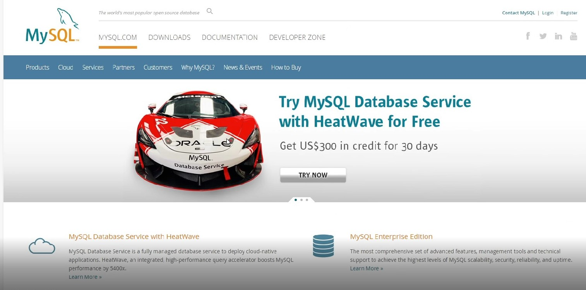
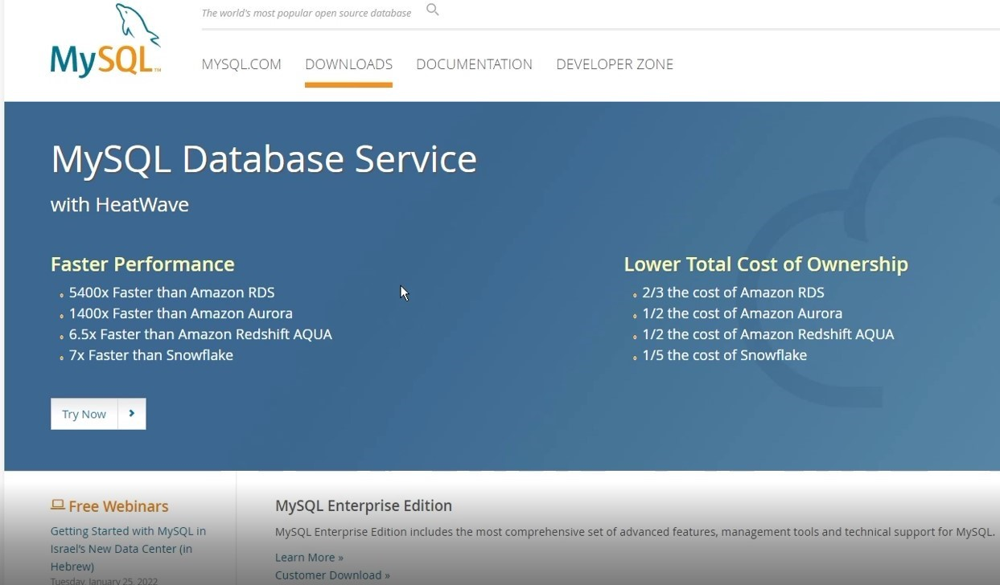
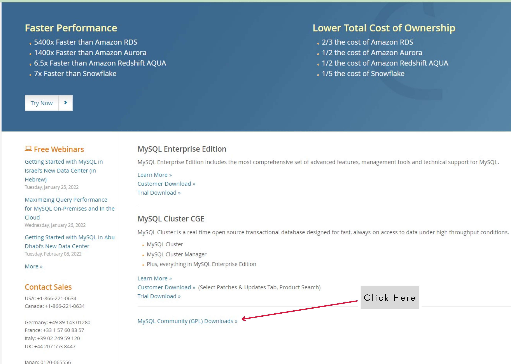
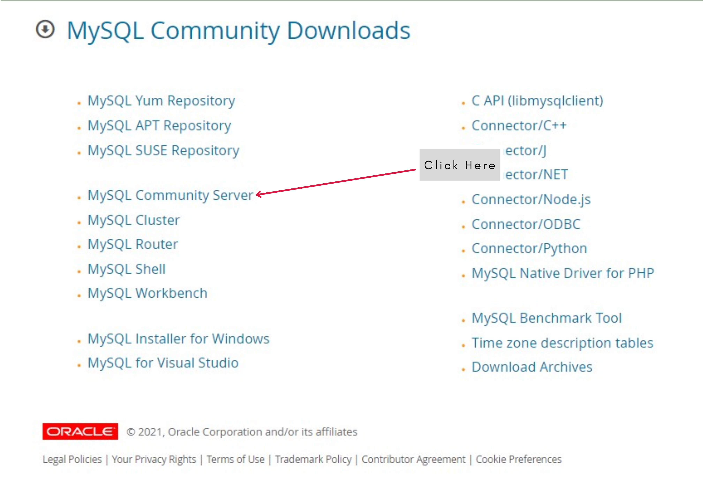
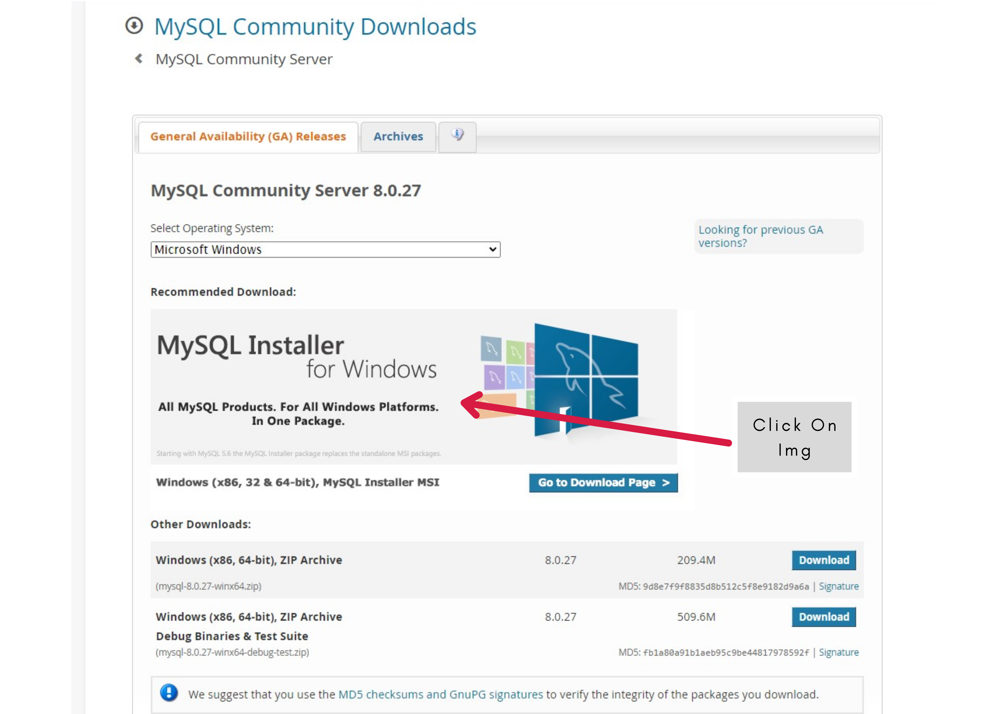
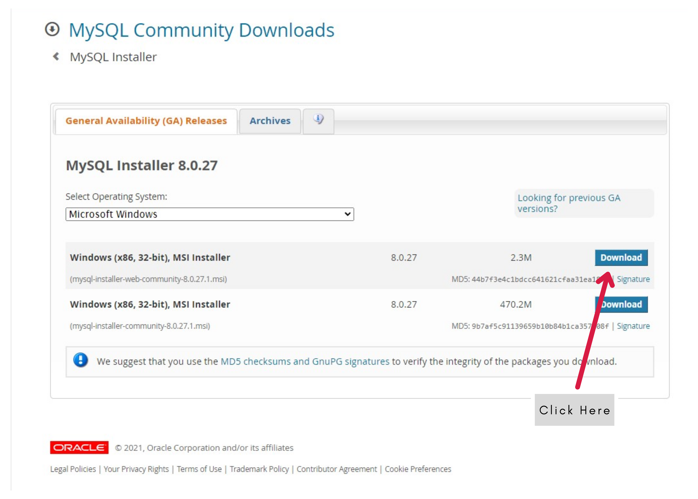

# Downloading Page
***1. Goto the Google***

***2. Search MySQL***

***3.SQL Page***

***3.Click Download Section***

***4 Scroll down then Click here***

***5.Click On MySQL Community Server***

***6.Click on MySQL Installer for Windows***

***7. Click On Download***

`OR`

***Direct Download Link***

+ SQL Downloading  [Link](https://dev.mysql.com/downloads/windows/installer/8.0.html) 

+ [How To Setup MySQL Server](../SQL/Setup.md)

+ My Video [Link]()

